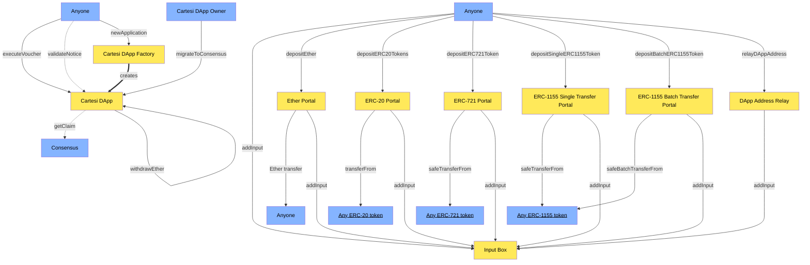

# Contracts 📚

Welcome to the project documentation! This repository contains essential documentation to guide you through the setup and usage of the project. Follow the steps below to get started:

## 1. Setting Up Environment 🌍

- Before you begin, make sure you have the required environment variables properly configured. Create an environment by executing the following command:

    ```bash
    $ make env
    ```

- Ensure you provide the necessary parameters in the generated environment file.

### 2.1 Deploy on testnet 🌐

- To implement the plugin contract (Proxy) in testnet, run the command below:

> [!IMPORTANT]
> Before deploying the above contract, it is necessary to modify the salt contained in [path](https://github.com/Tribes-Dapp/contracts/blob/main/script/utils/Helper.sol). Behind this implementation, we have a deterministic deployment; if the salt is not changed, the transaction will be reverted by the network.

    ```bash
    $ make plugin
    ```

 
- To call the Tribe contract bytecode, run the command bellow:

> [!IMPORTANT]
> Before call this script, it is necessary to modify the dapp address contained in [path](https://github.com/Tribes-Dapp/contracts/blob/main/script/TribeBytecode.s.sol).

    ```bash
    $ make bytecode
    ```

## 3. System Architecture 📐



## 4. Contracts Addresses 🔍

- Deployer Plugin():``
- KYCVerifier():``
- Cartesi Dapp():``

## 5. Viewing Documentation Locally 💻

View the generated documentation locally by serving it on a local server at port 4002. Use:

```bash
$ forge doc --serve --port 4002
```

Access the documentation through your web browser by navigating to <http://localhost:4002>.
